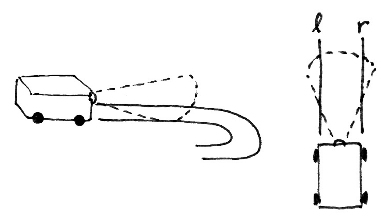
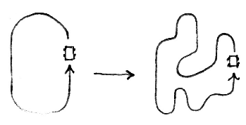
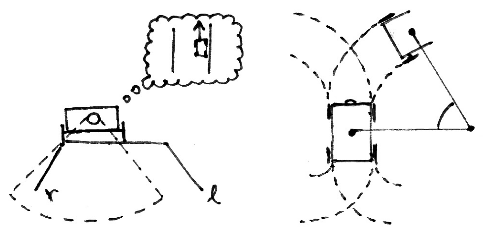

# Spring 2020 CSci 5551 Robotic Car Project

---

Autonomous racetrack-navigating robotic car project, designed and built for the University of
Minnesota Spring 2020 CSci 5551 class.

Table of Contents
=================

- [Concept](#concept)
- [Execution](#execution)
- [Equipment](#equipment)
- [Progress](#progress)
- [Challenges](#challenges)
- [FAQ](#faq)
- [License](#license)

### Concept

For our project we intend to program a robotic race car that can autonomously navigate a racetrack.
We plan for the track lane to be defined by a high contrast inner and outer edge, either visually
or physically constructed. The track will not be statically designed, but instead able to be
redesigned in any configuration given that it forms a complete loop with no intersections.

The car is equipped with a camera in order to see the track, and it will be programmed how to infer
which side of the track is the outer and inner edge, along with what it means to complete a lap on
said track.

 

### Execution

At the bare minimum we intend to accomplish the navigation of a simple racetrack where the track
configuration is not hard coded. From there on we would like to achieve a scenario where the robot
is able to navigate a more complex track configuration. If all goes well, we intend on using
machine learning and a set of heuristics to aid the robot in pushing the boundaries of navigation
in order to accomplish faster lap times until an optimal is reached.

### Equipment

- The race car is built upon a hobbyist remote control car chassis, specifically a
  [Horizon Hobby ECX Torment](https://www.horizonhobby.com/ECX01001T1).
- Upon the chassis is an [Arduino Uno](https://www.arduino.cc/en/Guide/ArduinoUno) and a [Raspberry 
  Pi 3 Model B](https://www.raspberrypi.org/products/raspberry-pi-3-model-b/).
- The motor is powered by a 7.2V LiPo battery and is controlled by a [Cytron 10A DC Motor Driver
  Shield for Arduino](https://www.cytron.io/p-10amp-7v-30v-dc-motor-driver-shield-for-arduino).
- Steering is controlled by a [Spektrum S401 Mini Servo](
  https://www.spektrumrc.com/Products/Default.aspx?ProdID=SPMS401) that came stock with the car.
- Computer power is supplied by a [Jackery Titan](https://www.jackery.com/), an 18,000mAh external
  battery with USB connections.

### Progress

- [ ] Serial communication between the Arduino and the Pi.
- [ ] Communication between the Pi and a PC.
- [ ] Manual control of the car over Wi-Fi.
- [ ] Track identification from captured images.
- [ ] Navigation of a simple oval track.
- [ ] Navigation of a complex, twisting track.
- [ ] Lap time optimization and tuning.

---

### FAQ

Is this crazy enough to work?
> I sure hope so!

---

### License

Copyright © 2020 Adam Peterson & Samuel Boldon

**[MIT license](http://opensource.org/licenses/mit-license.php)**
